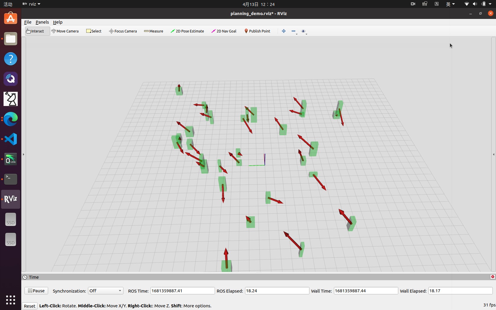
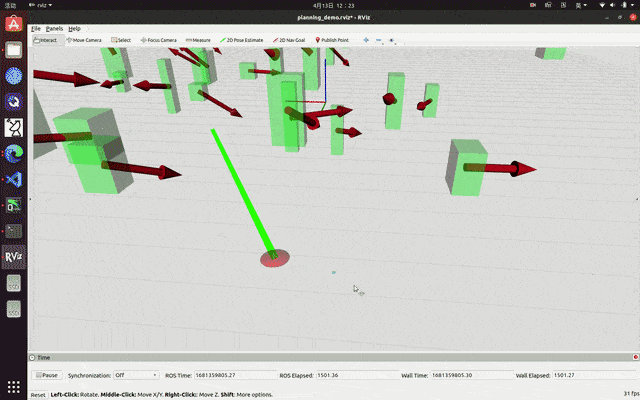

# Velocity Planner
A demo of the velocity planner related to our paper "Real-time Identification and Avoidance of Simultaneous Static and Dynamic Obstacles on Point Cloud for UAVs Navigation", accepted in Robotics and Autonomous Systems [J]. The algorithm is not exactly the same as that in the paper. We generate the trajectory segments in close-form and assemble the segments into a complete trajectory to the local goal. Both the computing time and flight smoothness are improved. Also, when the velocity candidates generated from the "forbidden pyramids" are all found infeasible, we try some random velocities instead of reducing the number of obstacles to be considered.

This repo only contains the planning part, and please refer to [this repo](https://github.com/chenhanpolyu/DynTrack) for dynamic obstacle perception. It is a better solution than that proposed in this paper. The object identification and motion estimation are all improved.

## Set up
Clone this repo into the src/ folder in your workspace and run "catkin_make" to build all the projects.

Open two terminals and source the workspace.

Then, launch the simulated dynamic environment by
````
roslaunch velplanner demo.launch
````
You will see 30 dynamic boxes moving at constant velocity in RVIZ like this (red arrows are velocities):



To launch the planner, run
````
roslaunch velplanner flyonce.launch 
````

You will see the fake drone (the red pie) flying along the planned trajectory (green line) to avoid all the obstacles.
